# Tic-Tac-Toe Server State Machine
Student: Ryan Amisi
Course: CS 457
Sprint: 1

## 1. Purpose

This specification describes the server's game states and transitions.
Message formats and framing are defined in protocol_blueprint.md.

The server owns the board and processes game events sequentially.
Only one move can change the board at a time.

Player_1 uses X, Player_2 uses O, and Player_1 moves first.

## 2. State Diagram

```mermaid
stateDiagram-v2
    direction TB

    [*] --> INIT
    INIT --> WAITING_FOR_PLAYERS: Server ready

    WAITING_FOR_PLAYERS --> WAITING_FOR_PLAYERS: First CONNECT / send LOBBY_WAIT
    WAITING_FOR_PLAYERS --> WAITING_FOR_PLAYERS: Invalid request / send ERROR
    WAITING_FOR_PLAYERS --> WAITING_FOR_PLAYERS: Player leaves / free slot
    WAITING_FOR_PLAYERS --> ACTIVE_GAME: Second CONNECT / start game

    state ACTIVE_GAME {
        [*] --> GAME_START
        GAME_START --> PLAYER_TURN: Send GAME_START / X first
        PLAYER_TURN --> PLAYER_TURN: Invalid message or wrong turn / ERROR
        PLAYER_TURN --> EVALUATE_MOVE: Current player sends valid MOVE schema
        EVALUATE_MOVE --> PLAYER_TURN: Occupied cell / ERROR / same turn
        EVALUATE_MOVE --> CHECK_WIN_DRAW: Empty cell / place symbol
        CHECK_WIN_DRAW --> PLAYER_TURN: No win or draw / switch turn / STATE_UPDATE
    }

    CHECK_WIN_DRAW --> GAME_OVER: Win or draw / final STATE_UPDATE
    ACTIVE_GAME --> GAME_OVER: DISCONNECT / forfeit
    ACTIVE_GAME --> GAME_OVER: EOF or socket failure / forfeit

    GAME_OVER --> CLEANUP: Send GAME_OVER where possible
    CLEANUP --> WAITING_FOR_PLAYERS: Close clients / reset match
```

A transition label describes the event followed by the server action.

## 3. State Definitions

| State | Server responsibility |
|---|---|
| INIT | Create the listening socket and initialize an empty board and player records |
| WAITING_FOR_PLAYERS | Accept CONNECT requests until two player slots are filled |
| GAME_START | Assign symbols, set Player_1 as the current player, and send GAME_START |
| PLAYER_TURN | Receive requests while waiting for the current player's move |
| EVALUATE_MOVE | Check whether the requested cell is empty |
| CHECK_WIN_DRAW | Check the board for a winning line or a full board |
| GAME_OVER | Record the outcome and notify connected players |
| CLEANUP | Close client connections and clear match data |

ACTIVE_GAME groups GAME_START, PLAYER_TURN, EVALUATE_MOVE, and
CHECK_WIN_DRAW. A departure detected in any of these states ends
the match as a forfeit unless a terminal result was already recorded.

## 4. Joining and Starting

A TCP connection alone does not reserve a player slot.
The client must send a valid CONNECT message.

The first accepted player becomes Player_1 and receives LOBBY_WAIT.
The second accepted player becomes Player_2.

When both slots are filled, the server:
1. Initializes the 3×3 board with empty strings.
2. Assigns X to Player_1 and O to Player_2.
3. Sets the current player to Player_1.
4. Sends GAME_START to both clients.
5. Enters PLAYER_TURN.

A third client receives GAME_FULL and its connection closes.
This does not change the current match.

A duplicate CONNECT from an assigned client receives INVALID_STATE.
If the only waiting player leaves, the server clears that slot and
continues waiting without awarding a win.

## 5. Move Processing

Validation occurs before changing the board.

| Condition | Response | State and board effect |
|---|---|---|
| Invalid JSON, schema, or message type | INVALID_MESSAGE | Keep current state, board, and turn |
| Client sends a server-only message | INVALID_MESSAGE | Keep current state, board, and turn |
| player_id does not match its connection | IDENTITY_MISMATCH | Keep current state, board, and turn |
| MOVE before the game starts | INVALID_STATE | Remain in WAITING_FOR_PLAYERS |
| MOVE from the other player | OUT_OF_TURN | Remain in PLAYER_TURN |
| row or col is not an integer from 0 to 2 | INVALID_COORDINATES | Remain in PLAYER_TURN |
| Selected cell is occupied | CELL_OCCUPIED | Return to PLAYER_TURN with the same player |
| Valid move selects an empty cell | Accept move | Place the symbol and enter CHECK_WIN_DRAW |

JSON booleans are not valid coordinate integers.
Every rejected move leaves the board and current player unchanged.

For an accepted move, the server checks:
1. Whether a row, column, or diagonal contains three matching symbols.
2. If there is no winner, whether all nine cells are occupied.

A winning line takes priority over a full-board draw.

If the game continues, the server switches the current player,
sends STATE_UPDATE to both clients, and returns to PLAYER_TURN.

If the move ends the game, the server sends STATE_UPDATE with
next_player null, then enters GAME_OVER.

## 6. Disconnect and Failure Handling

### Orderly departure

A valid DISCONNECT during ACTIVE_GAME makes the departing player
forfeit. The other player wins.

The server uses:
- result: "forfeit"
- winner: the remaining player's identity
- reason: "player_quit"

The departing connection is closed. GAME_OVER is sent to the
remaining client where possible.

### Unexpected transport failure

EOF, ConnectionResetError, BrokenPipeError, or another socket failure
is handled independently of the DISCONNECT message.

During an active match, the remaining player wins by forfeit with
reason "connection_lost".

If recv() returns b"", the server stops reading that connection.
It discards any unfinished frame and releases the connection.

An oversized frame also closes the offending connection and follows
the same departure rules.

TCP does not always detect an unreachable peer immediately.
This version has no application heartbeat or inactivity timeout.

### Event ordering

The server processes events sequentially.

If a winning move is processed before a disconnect, the recorded
win remains the result. If a disconnect is processed first, the
forfeit ends the match and later moves are not applied.

The outcome is recorded only once. Errors while sending GAME_OVER
must not create a second outcome or prevent cleanup.

If both clients are gone, the server still cleans up even though
there is no client available to receive GAME_OVER.

## 7. Game Over and Cleanup

For a win or forfeit, the winner receives a match score of 1 and
the other player receives 0. For a draw, both receive 0.

GAME_OVER includes the final board, result, winner, reason, and scores,
using the schema in protocol_blueprint.md.

Once the outcome is recorded, no additional MOVE changes the board.
Requests processed before closure may receive INVALID_STATE.

CLEANUP:
1. Closes both client sockets where necessary.
2. Removes their receive buffers and player records.
3. Clears the board, current player, and recorded outcome.
4. Returns to WAITING_FOR_PLAYERS.

The listening socket remains open. A new match requires new client
connections and new CONNECT messages.

## 8. Design Review Scenarios

These are planned checks for the later implementation, not executed tests.

| Scenario | Expected behavior |
|---|---|
| First player connects | LOBBY_WAIT; wait for the second player |
| Second player connects | GAME_START to both; X moves first |
| X makes a valid move | Board changes once; turn switches to O |
| O moves during X's turn | OUT_OF_TURN; no board or turn change |
| Player selects an occupied cell | CELL_OCCUPIED; same player retries |
| Player sends malformed JSON | INVALID_MESSAGE; server continues if the connection works |
| Third player tries to join | GAME_FULL; existing match continues |
| Player completes a winning line | Final STATE_UPDATE, then GAME_OVER |
| Board fills without a winner | GAME_OVER with result "draw" |
| Waiting player disconnects | Free slot; no forfeit |
| Active player sends DISCONNECT | Remaining player wins by forfeit |
| Active player's connection fails | Remaining player wins by forfeit |
| GAME_OVER cannot be delivered | Cleanup still completes |
| Match finishes | Close clients, reset match, and wait for new players |

## 9. Clarifications from the Protocol Review

The match enters ACTIVE_GAME when the second valid CONNECT is
accepted, including GAME_START. Departures from that point cause
a forfeit unless a terminal outcome has already been recorded.

Missing or extra fields produce INVALID_MESSAGE. For MOVE,
present row and col fields with incorrect types or values produce
INVALID_COORDINATES. Neither error changes the board or turn.

ERROR uses player_id null before a connection has an assigned
identity, including GAME_FULL. Otherwise, it uses the connection's
assigned player identity.
